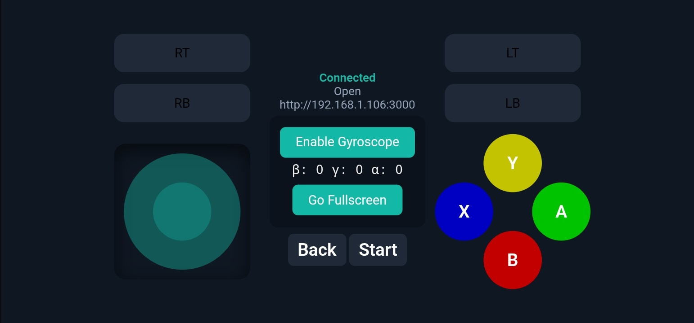

# Local Xbox Controller Emulator

## Table of Contents

* [About](#about)
* [Getting Started](#getting_started)
* [Usage](#usage)
* [Screenshot](#screenshot)
* [Contributing](../CONTRIBUTING.md)

## About <a name = "about"></a>

Local Xbox Controller Emulator is a web-based application that allows you to emulate an Xbox controller using your browser. You can use virtual joysticks, face buttons (A, B, X, Y), triggers, D-pad, and even a gyroscope to control games or applications that support Xbox controllers on your Windows machine.

The project is designed for local development and testing with multiple virtual controllers supported simultaneously, making it easy to experiment with controller input without needing physical hardware.

## Getting Started <a name = "getting_started"></a>

These instructions will get you a working copy of the project for development and testing on your local machine.

### Prerequisites

* Node.js (v18 or later recommended)
* npm (comes with Node.js)
* Windows (required for ViGEm bus driver)
* Chrome or Chromium-based browser for gyroscope support

### Installing

1. **Clone the repository**

```bash
git clone https://github.com/hamednazeri/Local-Xbox-Controller-Emulator.git
cd Local-Xbox-Controller-Emulator
```

2. **Install dependencies**

```bash
npm install
```

3. **Run the project**

```bash
npm run dev
```

This will start a local server, usually accessible at `http://localhost:3000`. You can also access it from other devices on your network using your local IP, e.g., `http://192.168.1.106:3000`.

---

### Gyroscope Support

To use the gyroscope functionality, your browser needs to treat your local address as a secure origin. In Chrome, do the following:

1. Open `chrome://flags`
2. Search for **Insecure origins treated as secure**
3. Add your local address, for example:

```
http://192.168.1.106:3000
```

4. Restart Chrome

This allows the gyroscope API to work even on a local, non-HTTPS connection.

---

## Usage <a name = "usage"></a>

Once the project is running:

* Open the URL in your browser.
* Use the on-screen joysticks, buttons, triggers, and D-pad to emulate controller input.
* Connect multiple devices simultaneously for multi-controller testing.
* The virtual Xbox controller will be recognized by your Windows system via the ViGEm bus driver.
* Supports vertical/mobile layout for better ergonomics on handheld devices.

---

## Screenshot <a name = "screenshot"></a>

The main page in **vertical mode** looks like this:



---

**Author:** Hamed Nazeri – [GitHub](https://github.com/hamednazeri)